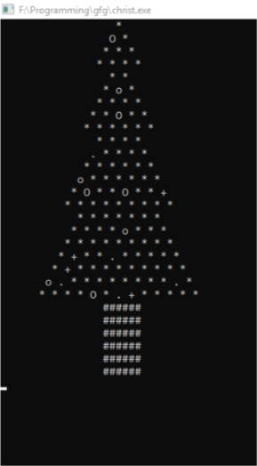
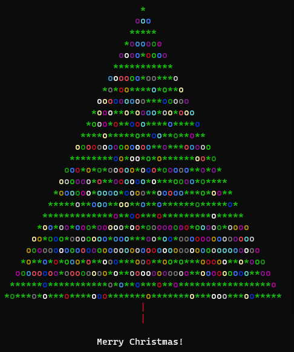

# Extreme Programming

Vous vous êtes fait contacter par le Père Nowel pour créer un programme qui imprime des sapins pour remédier à la déforestation de son environnement. Toutefois, il veut dissimuler le code dans la forme d’un sapin pour le camoufler. 

## Pointage
Pour les points, plus un sapin est petit, mieux c’est. Il doit être proportionné, et l’entièreté du code dans la forme. Vous devez montrer le nouveau sapin sous forme de print. Idéalement, il ne doit pas y avoir beaucoup d’espaces, on ne voudrait pas que le sapin soit vide…

Langage: Non spécifique (difficile en python, je vous laisse déterminer pourquoi…)
Idéalement: C#, C++, C, Java, Python

Example autre (beaucoup plus compliqué, c’est un donut 3d qui tourne):

Example 1: préféré (plus de points) 

Example 2 (Doit pouvoir avoir une hauteur resizable avec un input() / paramètre dans le code): 

